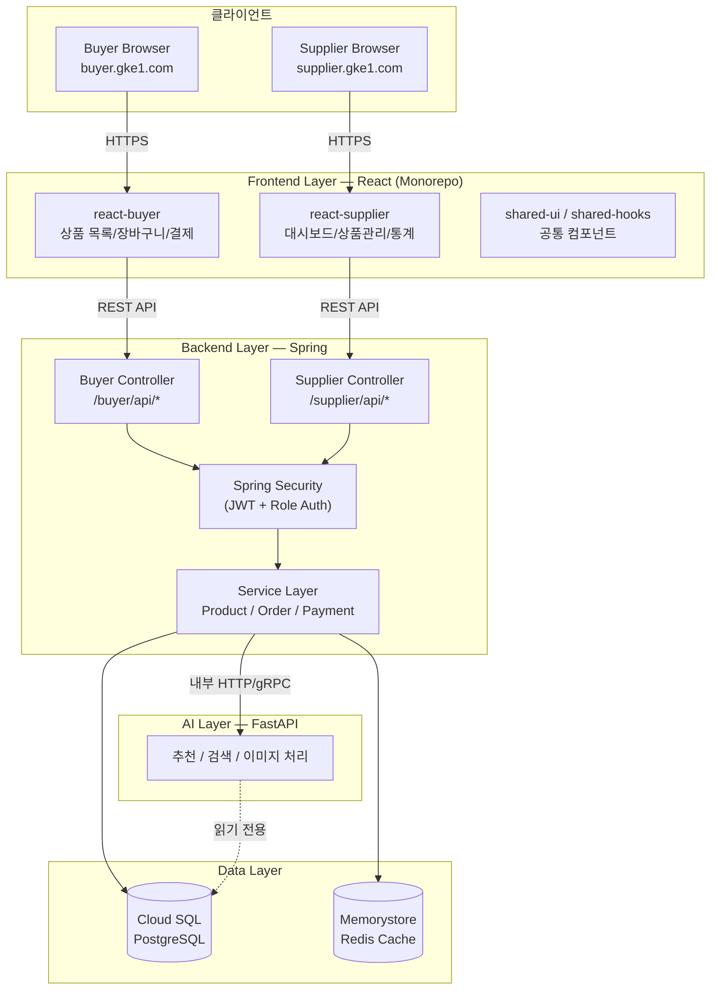
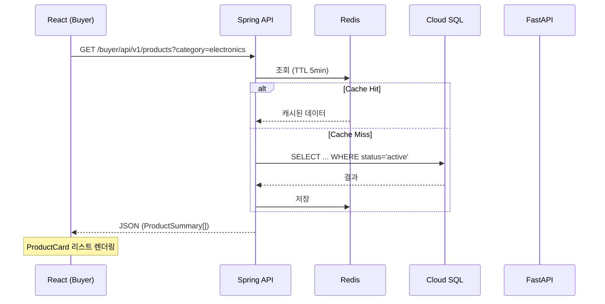
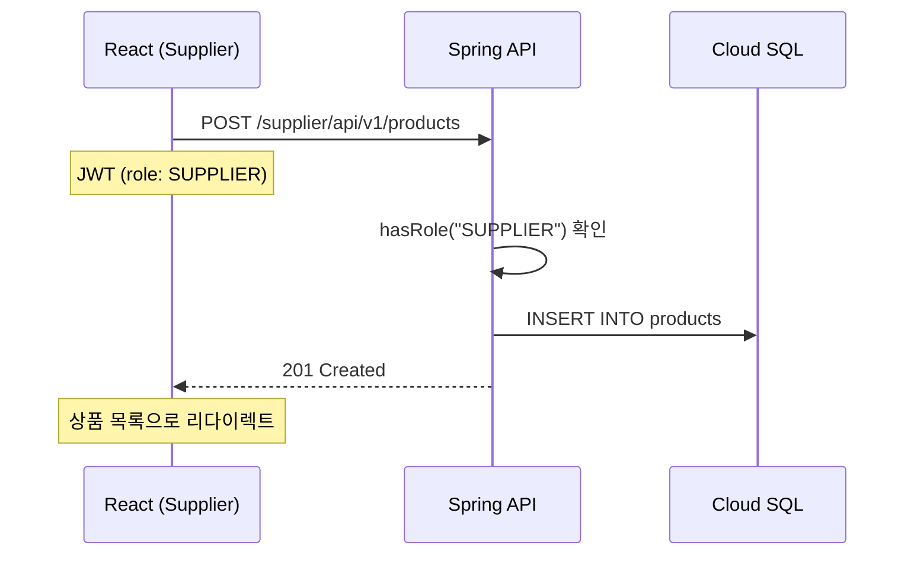
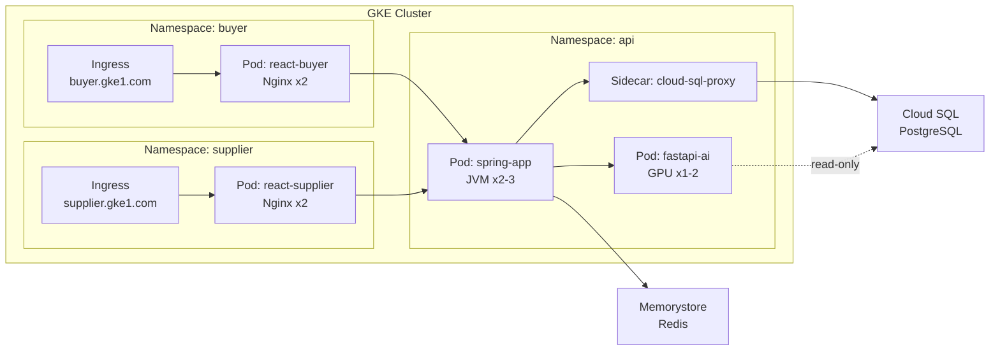

# GKE 쇼핑몰 시스템

> **GKE** 기반 쇼핑몰 플랫폼 — Buyer/Supplier Frontend 분리, Spring + FastAPI, Cloud SQL (PostgreSQL)

---

## 전체 아키텍처



---

## 주요 데이터 흐름

### 상품 목록 조회 (Buyer)



### 상품 등록 (Supplier)



---

## 인프라 (GKE)



---

## 시작하기

### Monorepo 구조

```bash
packages/
├── shared-ui/           # 공통 UI 컴포넌트
├── shared-hooks/        # 공통 React Hooks
├── shared-types/        # TypeScript interfaces
├── react-buyer/         # Buyer Frontend (React)
│   ├── Dockerfile       #   Node build → Nginx
│   └── nginx.conf
├── react-supplier/      # Supplier Frontend (React)
│   ├── Dockerfile       #   Node build → Nginx
│   └── nginx.conf
├── spring-app/          # Business API (Spring Boot + Gradle)
│   └── Dockerfile       #   Gradle build → JRE (ZGC)
└── fastapi-ai/          # AI API (FastAPI + Poetry)
    └── Dockerfile       #   Pip install → uvicorn
```

### Docker Build

```bash
# Buyer Frontend
docker build -f packages/react-buyer/Dockerfile -t gcr.io/PROJECT_ID/react-buyer .

# Supplier Frontend
docker build -f packages/react-supplier/Dockerfile -t gcr.io/PROJECT_ID/react-supplier .

# Spring App
docker build -f packages/spring-app/Dockerfile -t gcr.io/PROJECT_ID/spring-app .

# FastAPI
docker build -f packages/fastapi-ai/Dockerfile -t gcr.io/PROJECT_ID/fastapi-ai .
```

> **참고**: React Dockerfile은 monorepo root context에서 빌드해야 shared 패키지를 참조할 수 있습니다.
> `docker build -f packages/react-buyer/Dockerfile -t ... .` (`.` = repo root)

---

## 핵심 설계 원칙

- **Spring 단일 App 유지** — Security + NetworkPolicy로 Buyer/Supplier 격리, 분할은 팀/배포주기가 갈릴 때
- **AI 격리** — FastAPI는 비즈니스 트랜잭션에 직접 관여하지 않음, DB는 read-only
- **Role 기반 인가** — `BUYER` / `SUPPLIER` role로 endpoint 접근 제어
- **공유 컴포넌트** — 완전히 동일한 UI만 `shared-ui`, UX가 다르면 각 패키지에서 별도 구현

> 상세 문서: [gke.md](gke.md)

---

## GKE 배포 (k8s)

`k8s/` 디렉토리에 모든 매니페스트가 있습니다.

```bash
# 사전 준비
kubectl create secret generic cloud-sql-credentials \
  --namespace shop \
  --from-literal=username=DB_USER \
  --from-literal=password=DB_PASS \
  --from-literal=username_readonly=READONLY_USER \
  --from-literal=password_readonly=READONLY_PASS

kubectl create secret generic jwt-secret \
  --namespace shop \
  --from-literal=secret=YOUR_JWT_SECRET

# 배포
kubectl apply -k k8s/

# 확인
kubectl get all -n shop
kubectl get ingress -n shop
kubectl get managedcertificates -n shop
```

> **주의**: 배포 전에 `*.yaml` 파일에서 `PROJECT_ID`, `REGION`, `INSTANCE_NAME`을 실제 GCP 값으로 치환하세요.

### 리소스

| 서비스 | CPU (request/limit) | Memory (request/limit) | Replicas |
|---|---|---|---|
| spring-app | 2 / 4 | 4Gi / 8Gi | 2~6 (HPA) |
| fastapi-ai | 1 / 2 | 2Gi / 4Gi | 1~4 (HPA) |
| react-buyer | 100m / 500m | 128Mi / 256Mi | 2~10 (HPA) |
| react-supplier | 100m / 500m | 128Mi / 256Mi | 2~5 (HPA) |
| cloud-sql-proxy (sidecar) | 100m / 500m | 256Mi / 512Mi | - |
