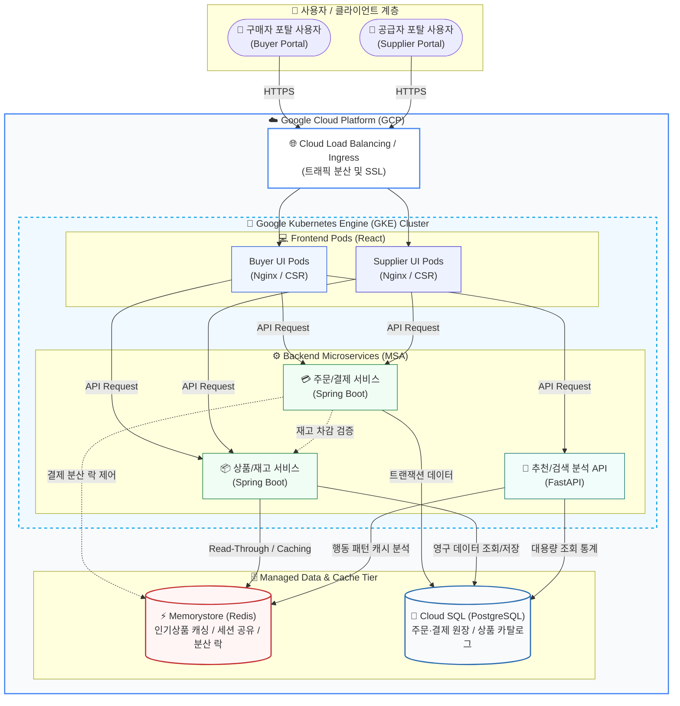

```mermaid
graph TB
    %% 글로벌 가용성 및 클라이언트 계층
    subgraph Client_Layer ["👥 사용자 / 클라이언트 계층"]
        Buyer(["🛒 구매자 포탈 사용자<br>(Buyer Portal)"])
        Supplier(["🏢 공급자 포탈 사용자<br>(Supplier Portal)"])
    end

    %% 인프라 / 라우팅 계층
    subgraph GCP_Infra ["☁️ Google Cloud Platform (GCP)"]
        LB["🌐 Cloud Load Balancing / Ingress<br>(트래픽 분산 및 SSL)"]

        %% GKE 클러스터 내부 (Stateless)
        subgraph GKE_Cluster ["🐳 Google Kubernetes Engine (GKE) Cluster"]
            
            subgraph FE_Pods ["💻 Frontend Pods (React)"]
                FE_Buyer["Buyer UI Pods<br>(Nginx / CSR)"]
                FE_Supplier["Supplier UI Pods<br>(Nginx / CSR)"]
            end

            subgraph BE_Pods ["⚙️ Backend Microservices (MSA)"]
                MS_Order["💳 주문/결제 서비스<br>(Spring Boot)"]
                MS_Product["📦 상품/재고 서비스<br>(Spring Boot)"]
                MS_AI["🤖 추천/검색 분석 API<br>(FastAPI)"]
            end
            
        end

        %% 데이터 및 캐시 계층 (Stateful 완전관리형 서비스)
        subgraph Data_Layer ["🗄️ Managed Data & Cache Tier"]
            Redis[("⚡ Memorystore (Redis)<br>인기상품 캐싱 / 세션 공유 / 분산 락")]
            Postgres[("💾 Cloud SQL (PostgreSQL)<br>주문·결제 원장 / 상품 카탈로그")]
        end
    end

    %% 컴포넌트 간 흐름 및 연결 관계 정의
    Buyer -->|HTTPS| LB
    Supplier -->|HTTPS| LB

    LB --> FE_Buyer
    LB --> FE_Supplier

    FE_Buyer -->|API Request| MS_Order
    FE_Buyer -->|API Request| MS_Product
    FE_Buyer -->|API Request| MS_AI

    FE_Supplier -->|API Request| MS_Product
    FE_Supplier -->|API Request| MS_Order

    %% 내부 서비스 간 통신 및 캐시 참조
    MS_Order -->|트랜잭션 데이터| Postgres
    MS_Order -.->|재고 차감 검증| MS_Product
    MS_Order -.->|결제 분산 락 제어| Redis

    MS_Product -->|Read-Through / Caching| Redis
    MS_Product -->|영구 데이터 조회/저장| Postgres

    MS_AI -->|행동 패턴 캐시 분석| Redis
    MS_AI -->|대용량 조회 통계| Postgres
    
    %% 스타일 가이드 (GCP 및 기술 스택 컬러 매칭)
    style GCP_Infra fill:#f8fafc,stroke:#4285F4,stroke-width:2px
    style GKE_Cluster fill:#f0f9ff,stroke:#0ea5e9,stroke-width:2px,stroke-dasharray: 5 5
    style LB fill:#fff,stroke:#4285F4,stroke-width:2px
    style FE_Buyer fill:#eff6ff,stroke:#1d4ed8,stroke-width:1px
    style FE_Supplier fill:#eef2ff,stroke:#4338ca,stroke-width:1px
    style MS_Order fill:#f0fdf4,stroke:#15803d,stroke-width:1px
    style MS_Product fill:#f0fdf4,stroke:#15803d,stroke-width:1px
    style MS_AI fill:#f0fdfa,stroke:#0f766e,stroke-width:1px
    style Redis fill:#fff5f5,stroke:#c53030,stroke-width:2px
    style Postgres fill:#f8fafc,stroke:#2b6cb0,stroke-width:2px
```

